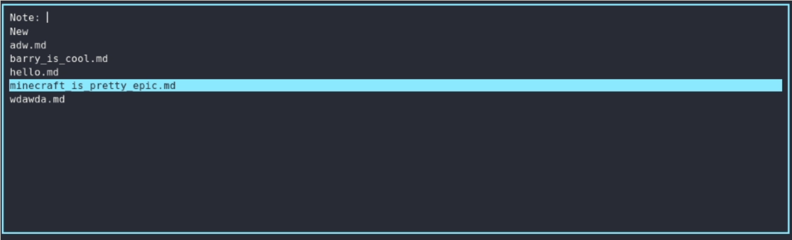
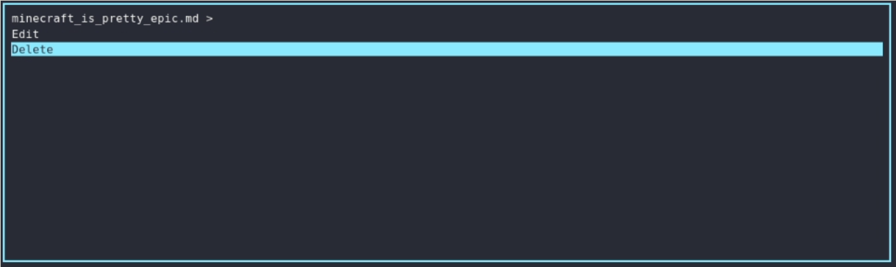
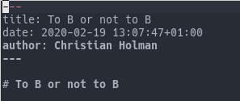

# RONO - Rofi Notes
Rono is a simple note manager using rofi to quickly create and view / edit markdown notes.

## Setup
To get started, edit the variables ```NOTES_FOLDER```, ```EDITOR```, and ```AUTHOR``` in rofi_notes.sh
Then you should be good to run the script.

## Screenshots
### Notes view

### Note context

### Generated note

